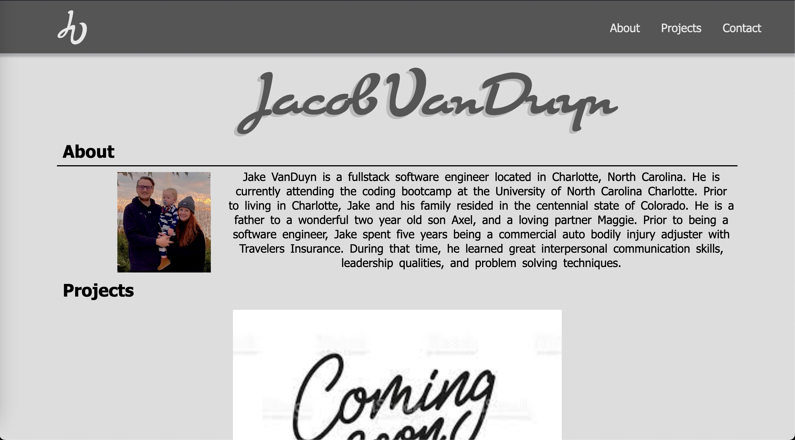

# Jacob VanDuyn's Portfolio

## Description

I created this website to host a place for potential employers and recruiters to be able to view my work on a website that I built. 

- My motivation was to build a functional website that would show future recruiters and employers my work and skills. 
- I wanted to build this project so that I could practice my HTML/CSS skills and show off my creative skills. 
- This website shows off my work that I will be completing during my time at UNCC coding bootcamp
- I was able to learn a few different tricks to be able to implement flex box. 

## Installation

- In order to view the code for my project, please visit https://github.com/Jvanduyn/Portfolio. From there you will want to click on the green "code" button. Then you will need to copy the HTTPS link. 

- From there you will need to open your terminal on your computer and type "git clone https://github.com/Jvanduyn/Portfolio.git". Then type "CD Portfolio". Then type "Code ."

- You can also view the live website at https://jvanduyn.github.io/Portfolio/

- Below is a screenshot of the live project. 

## Usage

## Credits

- I worked with my tutor Vinnie Lopez during this project and he assisted me with my CSS structure. 